# Eureka简介

## Eureka出现的原因

​     之前做单体式应用开发时很少提及服务发现，因为传统单体应用动态性不强，不会频繁的更新和重新发布，也较少进行自动伸缩。传统单体应用的网络位置很少发生变化，在发生变化时，由运维人员手工更新一下它们的配置文件，也不是什么太大的问题。

    而微服务架构则完全不同，微服务会被频繁的更新和重新发布，频繁的根据负载情况进行动态伸缩，微服务实例还可能受资源调度影响而从一台服务器迁移到另一台服务器。

​    总而言之，在微服务架构中，**微服务实例的网络位置发生变化是一种常态**，所以必须提供一种机制，使得服务消费者在服务提供者的网络位置发生变化时，能够及时获得最新的位置信息，一般是提供一个网络位置稳定的服务注册中心，服务提供者的网络位置被注册到注册中心，并在网络位置发生变化的时候及时更新，而服务消费者定期向注册中心获取服务提供者的最新位置信息，这就是最基本的服务发现机制。较为复杂的服务发现实现除了服务提供者的位置信息外，还可以向服务消费者提供服务提供者的描述信息、状态信息和资源使用信息，以供服务消费者实现更为复杂的服务选择逻辑。

我归纳:

微服务时代,为了做高可用,每个程序不得部署个最少3份(奇数份,不止一份),可是每次部署人工维护列表,快哭了.能不能自动一点.于是就有了eureka,你只要有名称,我不管你部署几份,部署在哪,就可以自动连通.牛不牛B..

## 微服务架构的根本问题

微服务的根本问题是什么,就是一个服务,多个实例,不容易管理..

怎么解决呢?答案是代理

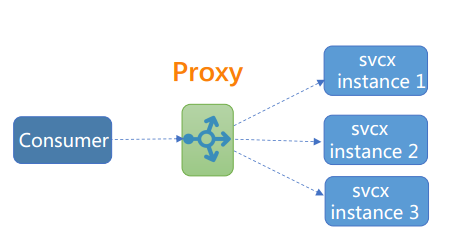

### 模式一:传统集中式代理

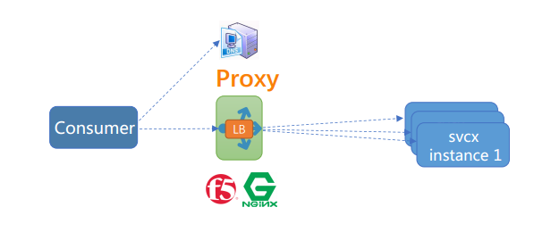

### 模式二:服务注册中心加客户端嵌入式模式

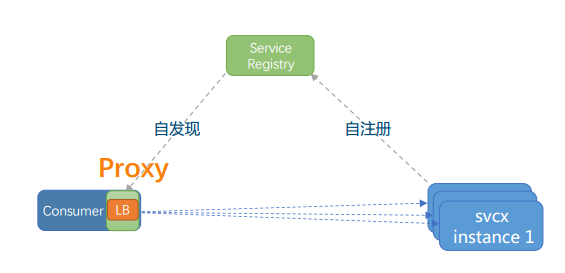

### 模式三:主机独立进程代理

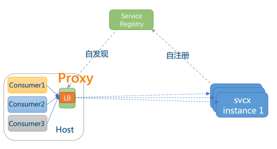

### 比较

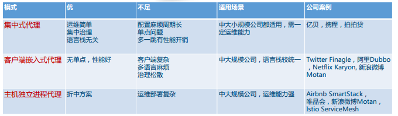

### 模式一变体1

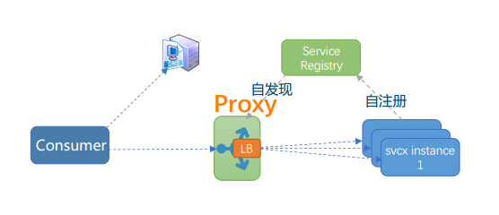

### 模式一变体2

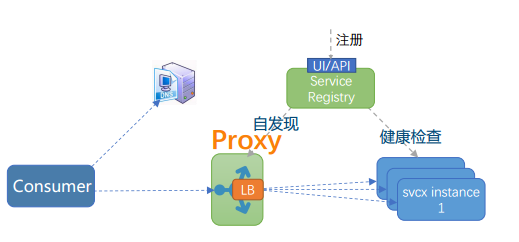

## 常见的服务发现比较

| 功能               | euerka                         | Consul                  | zookeeper             | etcd                |
| ------------------ | ------------------------------ | ----------------------- | --------------------- | ------------------- |
| 服务健康检查       | 客户端主动报心跳               | 服务状态，内存，硬盘等  | (弱)长连接，keepalive | 连接心跳            |
| 多数据中心         | 支持                           | 支持                    | —                     | —                   |
| kv存储服务         | 不支持                         | 支持                    | 支持                  | 支持                |
| 一致性             | 定制p2p                        | raft                    | paxos                 | raft                |
| cap                | AP                             | ca                      | cp                    | cp                  |
| 客户端接口         | java,http                      | 支持http和dns           | 客户端                | http/grpc           |
| watch支持          | 支持   long polling/大部分增量 | 全量/支持long   polling | 支持                  | 支持   long polling |
| 自身监控           | metrics                        | metrics                 | —                     | metrics             |
| 安全               | spring   security弱            | acl   /https            | acl                   | https支持（弱）     |
| spring   cloud集成 | 已支持                         | 已支持                  | 已支持                | 已支持              |
| 社区流行           | 流行                           | 流行                    | 一般                  | 一般                |

CAP原则又称CAP定理，指的是在一个分布式系统中，Consistency（一致性）、 Availability（可用性）、Partition tolerance（分区容错性）

个人感觉来说,consul是最优秀的...其次是eureka,zookeeper这就不说了,dubbo从阿里内部竞争就失败了,产品直接挂,卖开源个情怀了.但是consul是商业公司的东西.开源版本的未来不清楚.而且整合的话,肯定是netfilx全家桶.而且源码的话,eureka也便于阅读.

> 参考:http://www.infoq.com/cn/articles/background-architecture-and-solutions-of-service-discovery
>
> 参考:https://luyiisme.github.io/2017/04/22/spring-cloud-service-discovery-products/
>
> 推荐阅读:https://zhuanlan.zhihu.com/p/24829766

## 未来正在来临..

说实话,未来已经来临,虽然spring cloud的足够优秀,并且有落地产品.但是复杂啊,服务网格(ServiceMesh)的出现,极大了拉低了程序员的水平,但是抬高了运维水平.未来开发傻瓜化,devOps专家必然高薪.2018年什么最火,服务网格.

### 回顾下主机独立进程代理

### sidecar模式

上图描述了主机独立进程的服务发现策略,衍生出以下图

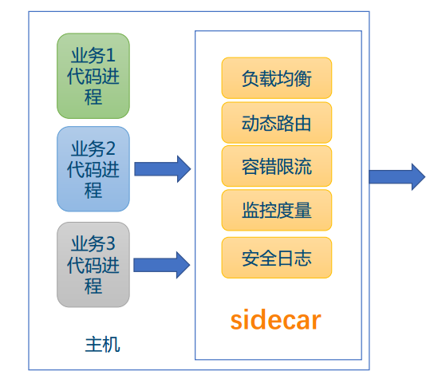

### 服务网格

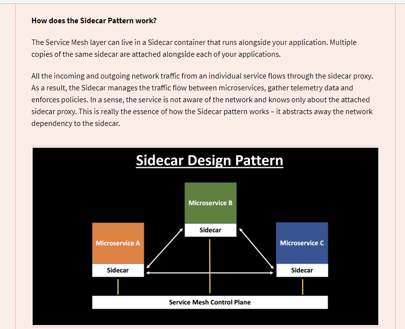

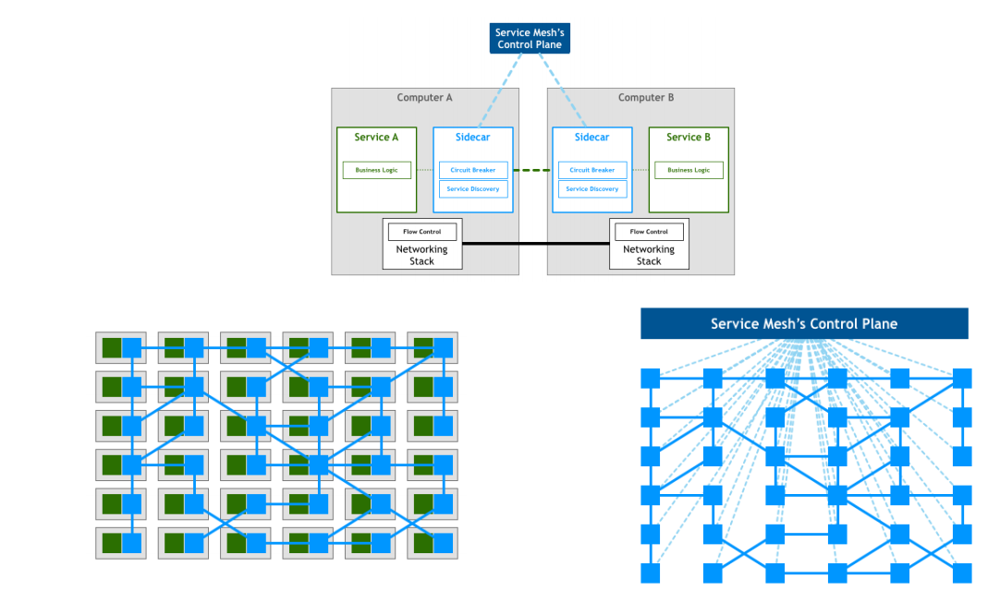

### istio架构

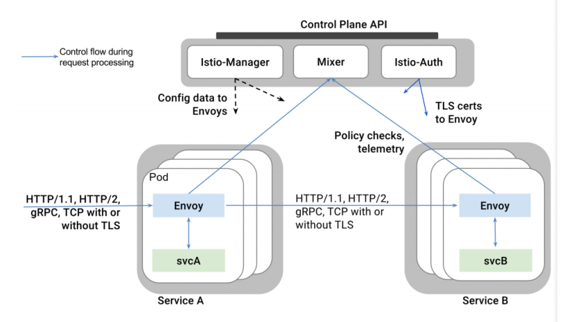

### 产品

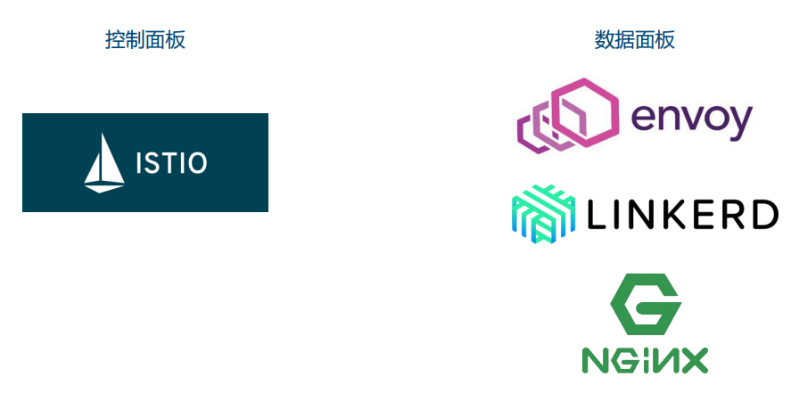

