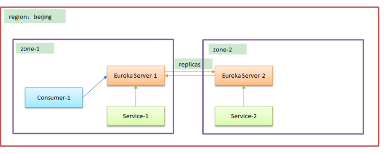
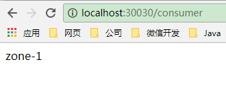
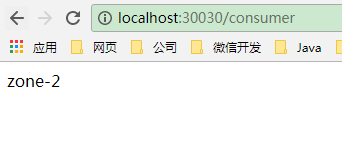

## 背景

用户量比较大或者用户地理位置分布范围很广的项目，一般都会有多个机房。这个时候如果上线springCloud服务的话，我们希望一个机房内的服务优先调用同一个机房内的服务，当同一个机房的服务不可用的时候，再去调用其它机房的服务，以达到减少延时的作用。

## 概念

eureka提供了region和zone两个概念来进行分区，这两个概念均来自于亚马逊的AWS：

- region：可以简单理解为地理上的分区，比如亚洲地区，或者华北地区，再或者北京等等，没有具体大小的限制。根据项目具体的情况，可以自行合理划分region。
- zone：可以简单理解为region内的具体机房，比如说region划分为北京，然后北京有两个机房，就可以在此region之下划分出zone1,zone2两个zone。

## 分区服务架构图



如图所示，有一个region:beijing，下面有zone-1和zone-2两个分区，每个分区内有一个注册中心Eureka Server和一个服务提供者Service。
我们在zone-1内创建一个Consumer-1服务消费者的话，其会优先调用同一个zone内的Service-1，当Service-1不可用时，才会去调用zone-2内的Service-2。

## 配置

1. Eureka Server-1：

   ```
   spring:
     application:
       name: Server-1
   server:
     port: 30000
   eureka:
     instance:
       prefer-ip-address: true
       status-page-url-path: /actuator/info
       health-check-url-path: /actuator/health
       hostname: localhost
     client:
       register-with-eureka: true
       fetch-registry: true
       prefer-same-zone-eureka: true
       #地区
       region: beijing
       availability-zones:
         beijing: zone-1,zone-2
       service-url:
         zone-1: http://localhost:30000/eureka/
         zone-2: http://localhost:30001/eureka/
   ```

2. Eureka Server-2：

   ```
   spring:
     application:
       name: Server-2
   server:
     port: 30001
   eureka:
     instance:
       prefer-ip-address: true
       status-page-url-path: /actuator/info
       health-check-url-path: /actuator/health
       hostname: localhost
     client:
       register-with-eureka: true
       fetch-registry: true
       prefer-same-zone-eureka: true
       #地区
       region: beijing
       availability-zones:
         beijing: zone-2,zone-1
       service-url:
         zone-1: http://localhost:30000/eureka/
         zone-2: http://localhost:30001/eureka/
   ```

3. Service-1:

   测试代码：

   ```
   @RestController
   public class HiController {
       @Value("${zone.name}")
       private String zoneName;
       
       @RequestMapping(value = "/hi", method = RequestMethod.GET)
       public String hi() {
           return zoneName;
       }
   }
   ```

   配置文件：

   ```
   spring:
     application:
       name: service
   server:
     port: 30010
   eureka:
     instance:
       prefer-ip-address: true
       status-page-url-path: /actuator/info
       health-check-url-path: /actuator/health
       metadata-map:
         zone: zone-1
     client:
       register-with-eureka: true
       fetch-registry: true
       prefer-same-zone-eureka: true
       #地区
       region: beijing
       availability-zones:
         beijing: zone-1,zone-2
       service-url:
         zone-1: http://localhost:30000/eureka/
         zone-2: http://localhost:30001/eureka/
   
   zone.name: zone-1
   ```

4. Service-2:

   ```
   spring:
     application:
       name: service
   server:
     port: 30011
   eureka:
     instance:
       prefer-ip-address: true
       status-page-url-path: /actuator/info
       health-check-url-path: /actuator/health
       metadata-map:
         zone: zone-2
     client:
       register-with-eureka: true
       fetch-registry: true
       prefer-same-zone-eureka: true
       #地区
       region: beijing
       availability-zones:
         beijing: zone-2,zone-1
       service-url:
         zone-1: http://localhost:30000/eureka/
         zone-2: http://localhost:30001/eureka/
   
   zone.name: zone-2
   ```

5. Consumer-1:

   调用服务代码：

   ```
   @RestController
   public class HiController {
       @Autowired
       private RestTemplate restTemplate;
   
       @RequestMapping(value="/consumer")
       public String hi() {
           return restTemplate.getForObject("http://service/hi", String.class);
       }
   }
   ```

   配置文件：

   ```
   spring:
     application:
       name: consumer
   server:
     port: 30030
   eureka:
     instance:
       prefer-ip-address: true
       status-page-url-path: /actuator/info
       health-check-url-path: /actuator/health
       metadata-map:
         zone: zone-1
     client:
       register-with-eureka: true
       fetch-registry: true
       prefer-same-zone-eureka: true
       #地区
       region: beijing
       availability-zones:
         beijing: zone-1,zone-2
       service-url:
         zone-1: http://localhost:30000/eureka/
         zone-2: http://localhost:30001/eureka/
   ```

## 效果演示



可以看到Consumer-1优先调用的是同一个zone-1的Service-1，这个时候，无论怎么刷新，调用多少次，都只会调用Service-1，不会调用Service-2.

当我们把Service-1服务停掉，再调用的话：



才会调用zone-2分区下的Service-2。

## 配置文件讲解

整个分区分为两步：

1. 服务注册：要保证服务注册到同一个zone内的注册中心，因为如果注册到别zone的注册中心的话，网络延时比较大，心跳检测很可能出问题。
2. 服务调用：要保证优先调用同一个zone内的服务，只有在同一个zone内的服务不可用时，才去调用别zone的服务。

### 1. 服务注册的配置文件

```
eureka:
  client:
    prefer-same-zone-eureka: true
    #地区
    region: beijing
    availability-zones:
      beijing: zone-1,zone-2
    service-url:
      zone-1: http://localhost:30000/eureka/
      zone-2: http://localhost:30001/eureka/
```

当一个服务（作为一个eureka client）向注册中心（eureka server）注册的时候，会根据eureka.client下的配置来进行注册。这里我们主要关心有多个注册中心的情况下，服务会注册到哪个注册中心，并且和哪个注册中心来维持心跳检测。
**注册中心选择逻辑**：
**1. 如果prefer-same-zone-eureka为false，按照service-url下的 list取第一个注册中心来注册，并和其维持心跳检测。不会再向list内的其它的注册中心注册和维持心跳。只有在第一个注册失败的情况下，才会依次向其它的注册中心注册，总共重试3次，如果3个service-url都没有注册成功，则注册失败。每隔一个心跳时间，会再次尝试。**
**2. 如果prefer-same-zone-eureka为true，先通过region取availability-zones内的第一个zone，然后通过这个zone取service-url下的list，并向list内的第一个注册中心进行注册和维持心跳，不会再向list内的其它的注册中心注册和维持心跳。只有在第一个注册失败的情况下，才会依次向其它的注册中心注册，总共重试3次，如果3个service-url都没有注册成功，则注册失败。每隔一个心跳时间，会再次尝试。**

**所以说，为了保证服务注册到同一个zone的注册中心，一定要注意availability-zones的顺序，必须把同一zone写在前面**

### 2. 服务调用的配置文件

```
eureka:
  instance:
    metadata-map:
      zone: zone-1
```

**服务消费者和服务提供者分别属于哪个zone，均是通过eureka.instance.metadata-map.zone来判定的。**
**服务消费者会先通过ribbon去注册中心拉取一份服务提供者的列表，然后通过eureka.instance.metadata-map.zone指定的zone进行过滤，过滤之后如果同一个zone内的服务提供者有多个实例，则会轮流调用。**
**只有在同一个zone内的所有服务提供者都不可用时，才会调用其它zone内的服务提供者。**

## 扩展

```
eureka.instance.lease-renewal-interval-in-seconds: 30
```

服务和注册中心的心跳间隔时间，默认为30s

```
eureka.instance.lease-expiration-duration-in-seconds: 90
```

服务和注册中心的心跳超时时间，默认为90s

也就是说，当一个服务异常down掉后，90s之后注册中心才会知道这个服务不可用了。在此期间，依旧会把这个服务当成正常服务。ribbon调用仍会把请求转发到这个服务上。为了避免这段期间出现无法提供服务的情况，要开启ribbon的重试功能，去进行其它服务提供者的重试。